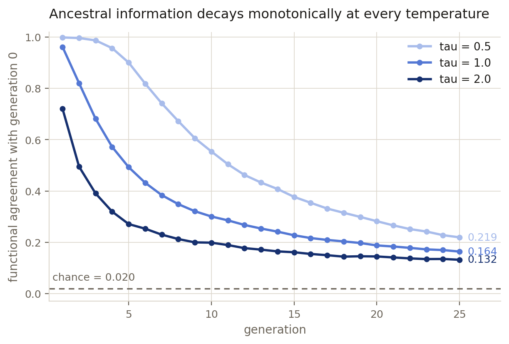
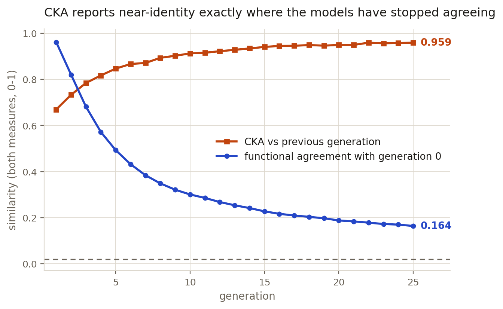
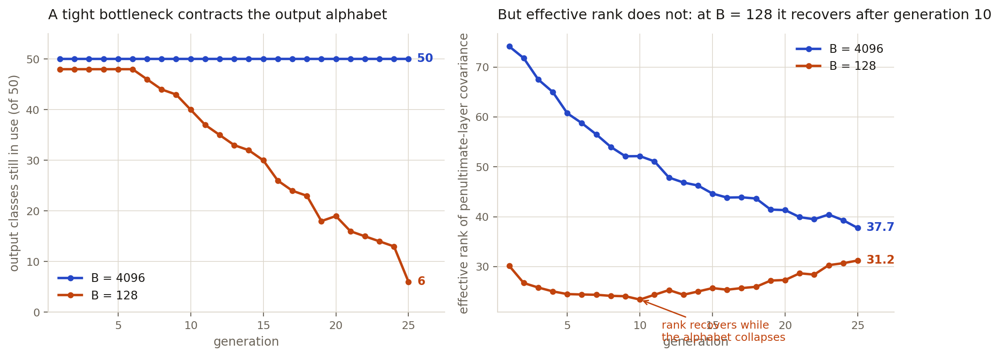
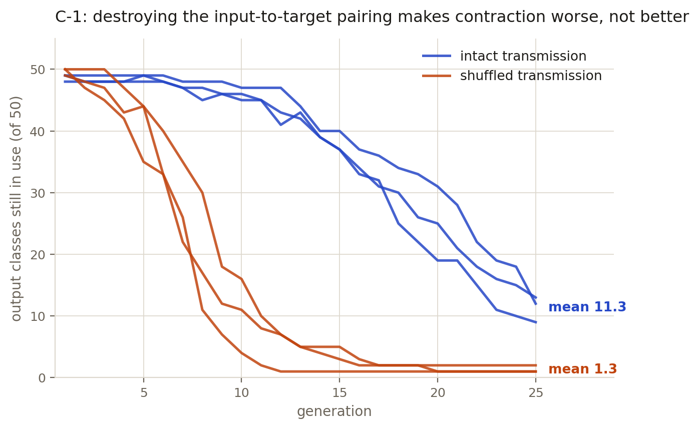

# Survival of the Fitted

**What happens when AI models are trained on other AI models' output, over and over for a long period of time?**

CSCI semester research project — Sakxam Shrestha.

---

## The idea

We all know the party game Telephone. Someone whispers a sentence, it goes around the circle,
and what comes out the other end is mangled.

Here is the part people get wrong about that game. If we keep on playing not one round, but
hundreds, the message does not turn into random noise. It settles into something short and
catchy and easy to remember. Every round, whatever was hard to hold onto falls away, and
whatever is easy for human memory survives. After enough rounds the sentence has stopped
telling you anything about what was originally whispered. It tells you about the players.

This project plays Telephone with neural networks.

I train a network on real labelled data. Then I throw the data away. A brand-new network is
trained using only the first network's predictions on a limited handful of inputs — it never
sees a real label, not once. Then a third network learns only from the second. And so on,
for twenty-five generations.

Then I will try measure two different things about the last network in the chain:

- **What it computes** — does it still agree with the original network about anything?
- **What it still says** — of the fifty possible output categories, how many does it even
  use any more?

Those two turn out to come apart in interesting ways, and the gap between them is what this
project is about.

## Why anyone should care

The open internet is filling up with machine-generated text and images at a lot of faster pace than we can imagine. That means the next generation of models will be trained partly on the output of the current one, whether or not
anybody plans it that way. Nobody is going to run twenty-five clean generations in the real
world, but the direction of travel is real.

What makes this scientifically interesting is that two established research literatures
predict **opposite** outcomes for the same process:

- **Model-collapse research** expects degradation. Rare cases vanish first, then variety
  goes, and eventually the model is repeating itself.
- **Iterated-learning research** in cognitive science expects the reverse. It holds that a
  narrow bottleneck between generations *creates* structure, because only the simple,
  learnable patterns are able to survive being passed down repeatedly.

The goal is to find out which actually can happen in chains of neural networks, and — more
usefully — what controls the answer.

---

## Where the project stands

### The chain always loses information. Nothing self-organises.

Agreement with the founding model decays toward chance in **every** condition tested. There
is no setting where structure appears out of nowhere. The project originally asked whether
structure might self-organise from a chain seeded on pure random noise; it does not, and
that framing was dropped on this evidence.

Twenty-five generations, fifty output classes, so chance agreement is exactly 0.020:

| condition | agreement with generation 0 | classes still in use |
|---|---|---|
| tau = 0.5, B = 4096 | 0.219 | 50 |
| tau = 1.0, B = 4096 | 0.164 | 50 |
| tau = 2.0, B = 4096 | 0.132 | 48 |
| tau = 1.0, B = 512 | 0.048 | 50 |
| tau = 1.0, B = 128 | **0.024** | **6** |

`tau` is the distillation temperature. `B` is the **bottleneck** — how many examples get
passed to the next generation. Temperature changes how fast things decay. The bottleneck
changes the outcome entirely.

### The standard similarity metric is blind to all of this

This is the most useful thing the project has produced so far, and it was an accident.

CKA (Centered Kernel Alignment) is a standard way of asking whether two networks have
learned the same thing, and it was the main metric in my original proposal. Measured between
consecutive generations it climbs to **0.959** — which reads as "these models are
essentially identical" — at exactly the point where the models' actual predictions agree only
**0.164** of the time.

The two lines cross at generation three and head in opposite directions. Had I reported the
metric I originally proposed, I would have concluded that nothing was happening. I now report
three metrics together, and CKA only as a warning. (This blindness was already documented by
Davari et al., ICLR 2023 — so this is a replication in a new setting, not a discovery.)

### A tight bottleneck makes the model stop using most of its vocabulary

At B = 128, the network goes from using forty-eight of its fifty output classes down to
**six**. An earlier run stopped at twenty generations and found nineteen classes still alive;
extending to twenty-five showed that the process had not finished. The earlier number was not
a resting state.

The right-hand panel is the surprise. **Effective rank** — a measure of how much of the
representation space is actually being used — falls to a minimum at generation 10 and then
climbs back up, while the output vocabulary is still collapsing. Two things that usually get
lumped together as "collapse" are moving in opposite directions.

### Where a chain ends up depends on where it started

Running twenty chains from the **same** founding model, they land on overlapping sets of
surviving classes at 2.12x the overlap expected by chance, with a 95% confidence interval of
[0.152, 0.236] against a chance level whose upper tail reaches only 0.102. Running twenty
chains from **different** founding models, the overlap is 0.93x chance — the interval sits
inside the chance band. A permutation test on the contrast between the two gives p < 0.0001.

An earlier version of this section reported 2.94x and 1.13x from five chains per arm. Those
came from ten pairwise comparisons with no interval, and the effect size was inflated. The
larger sample corrects the magnitude downward while making the finding considerably harder to
dismiss: the odds of seeing this contrast by luck fell from about 1 in 120 to under 1 in
10,000. Recomputing over the first five runs of the new log reproduces the old numbers
exactly, so nothing about the experiment changed — only how many times it was run.

This **falsified** a hypothesis I had proposed myself: that the chain could be used as an
instrument to read out an architecture's built-in bias. If that were true, different founders
should have converged on the same classes. At four times the original sample, they still do
not. The falsification is kept in the record because it is the useful part.

### The control that attacked my own result

The concern with the vocabulary-collapse finding is that it might mean nothing — classes
might just be dying off by frequency, telling us nothing about what the model learned.

So: shuffle the teacher's outputs against the inputs before each generation trains. The same
set of outputs gets handed over, just attached to the wrong inputs. If the collapse survives
that, the finding is weak.

It survived — and got dramatically **worse**. Shuffled chains collapse to a single surviving
class.

| arm | surviving classes (3 seeds) | mean |
|---|---|---|
| intact transmission | 9, 12, 13 | **11.3** |
| shuffled transmission | 1, 2, 1 | **1.3** |

So the original framing was too strong and has been corrected. But the control handed back a
sharper question than the one it removed: keeping the input-to-output pairing intact
**protects** the vocabulary, by roughly a factor of nine. Three seeds only, so this is
preliminary.

### A theory claim in my notes turned out to be backwards

The theoretical finding that serves as the foundation for this research project is Griffiths and Kalish (2007). According to my earlier notes, it seems that neural networks which are trained using the technique of gradient descent do not tend to converge on their expected outcome, which I took to mean that I was correct in my assertion.
The paper that I read, however, did not indicate this. In fact, their findings show that those neural networks which select the best answer are supposed to converge on this answer even more strongly than the neural networks which choose among options. A narrower bottleneck does mean more influence of the bias on the output of the neural networks and not vice versa.
All this makes it necessary for me to think again about what I can claim. The theoretical framework does not include my findings concerning founder dependency and this makes them more interesting than if they had confirmed existing evidence.
