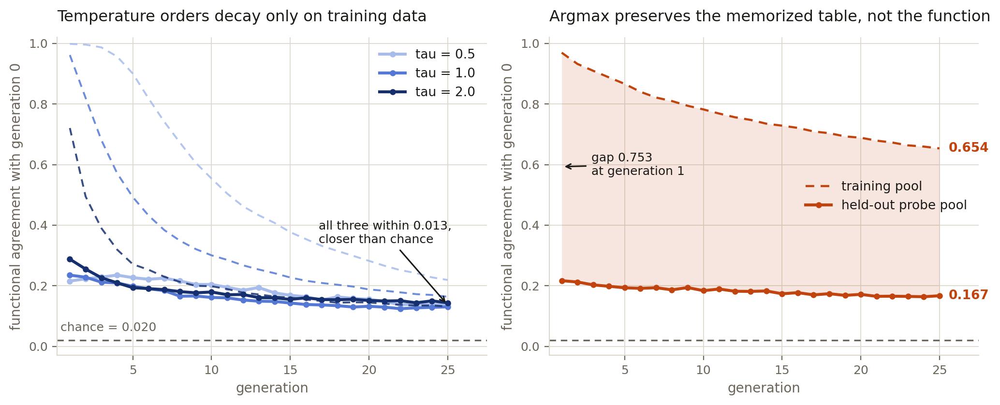
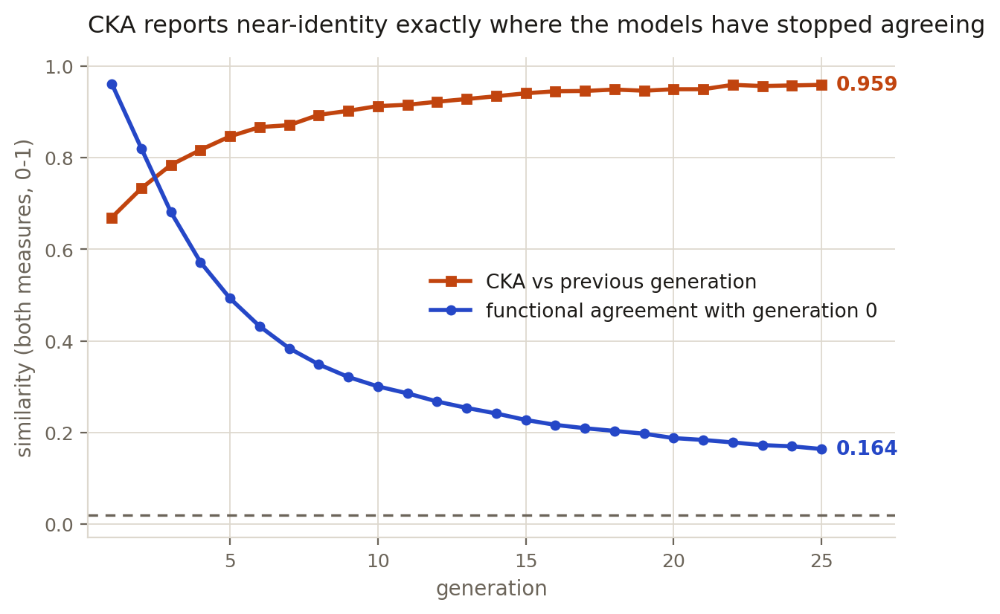
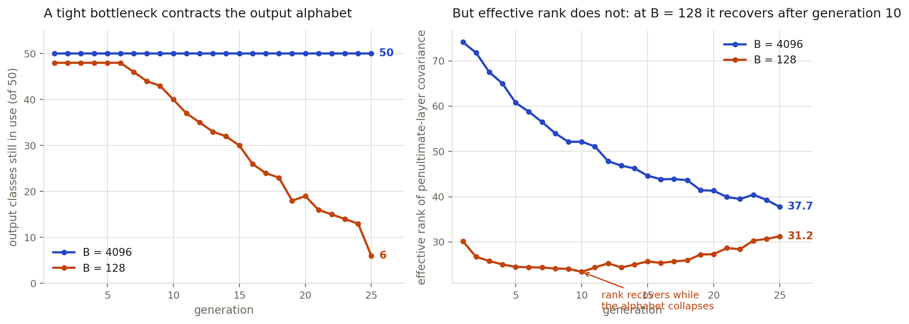
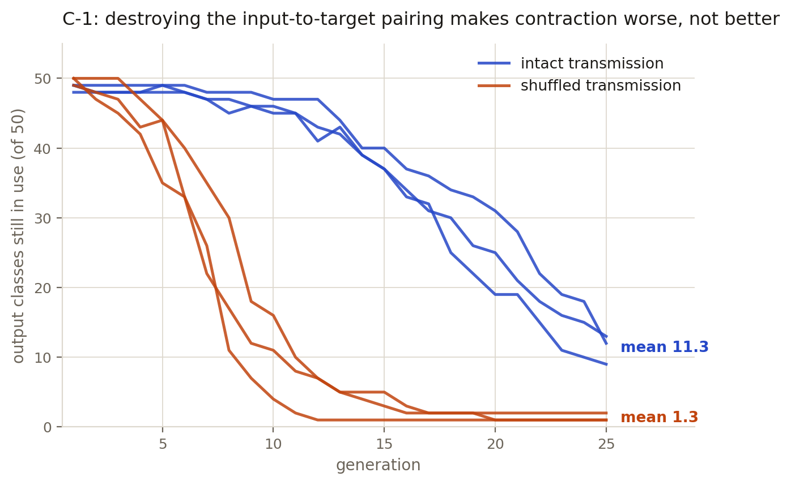

# Survival of the Fitted

**What happens when AI models are trained on other AI models' output, over and over for a long period of time?**

CSCI semester research project — Sakxam Shrestha.

---

## The idea

We all know the party game Telephone. Someone whispers a sentence, it goes around the circle,
and what comes out the other end is mangled.

Here is the part people get wrong about that game. If we keep on playing not one round, but
hundreds, the message does not turn into random noise. It settles into something short and
catchy and easy to remember. Every round, whatever was hard to hold onto falls away, and
whatever is easy for human memory survives. After enough rounds the sentence has stopped
telling you anything about what was originally whispered. It tells you about the players.

This project plays Telephone with neural networks.

I train a network on real labelled data. Then I throw the data away. A brand-new network is
trained using only the first network's predictions on a limited handful of inputs — it never
sees a real label, not once. Then a third network learns only from the second. And so on,
for twenty-five generations.

Then I will try measure two different things about the last network in the chain:

- **What it computes** — does it still agree with the original network about anything?
- **What it still says** — of the fifty possible output categories, how many does it even
  use any more?

Those two turn out to come apart in interesting ways, and the gap between them is what this
project is about.

## Why anyone should care

The open internet is filling up with machine-generated text and images at a lot of faster pace than we can imagine. That means the next generation of models will be trained partly on the output of the current one, whether or not
anybody plans it that way. Nobody is going to run twenty-five clean generations in the real
world, but the direction of travel is real.

What makes this scientifically interesting is that two established research literatures
predict **opposite** outcomes for the same process:

- **Model-collapse research** expects degradation. Rare cases vanish first, then variety
  goes, and eventually the model is repeating itself.
- **Iterated-learning research** in cognitive science expects the reverse. It holds that a
  narrow bottleneck between generations *creates* structure, because only the simple,
  learnable patterns are able to survive being passed down repeatedly.

The goal is to find out which actually can happen in chains of neural networks, and — more
usefully — what controls the answer.

---

## Where the project stands

### The chain always loses information. Nothing self-organises.

Agreement with the founding model decays toward chance in **every** condition tested. There
is no setting where structure appears out of nowhere. The project originally asked whether
structure might self-organise from a chain seeded on pure random noise; it does not, and
that framing was dropped on this evidence.

Twenty-five generations, fifty output classes, so chance agreement is exactly 0.020.

Two columns, because which one you read matters. Metrics in this project were originally
computed on the same 4,096 inputs the chain trains on. A control (C-6) recomputed everything
on a second pool of inputs no model ever trains on. The held-out column is the honest one.

| condition | agreement (training inputs) | agreement (held-out) | classes in use |
|---|---|---|---|
| tau = 0.5, B = 4096 | 0.219 | 0.138 | 50 |
| tau = 1.0, B = 4096 | 0.164 | 0.130 | 50 |
| tau = 2.0, B = 4096 | 0.132 | 0.144 | 49 |
| tau = 1.0, B = 512 | 0.048 | 0.058 | 49 |
| tau = 1.0, B = 128 | **0.024** | **0.025** | **9** |

`tau` is the distillation temperature. `B` is the **bottleneck** — how many examples get
passed to the next generation.

**The bottleneck changes the outcome entirely, and it holds up on held-out inputs:** 0.025 at
B = 128 against 0.130 at B = 4096, the same ordering in both columns.

**Temperature does not.** On training inputs the three temperatures look cleanly ordered,
spread across 0.087. On held-out inputs they land within 0.013 of each other — closer
together than chance agreement is to zero — and not even in the right order. An earlier
version of this section said "temperature changes how fast things decay." That was an
artifact of measuring on the training pool, and it is withdrawn.

The right-hand panel is the same mistake in its most extreme form. Passing hard `argmax`
labels between generations appeared to preserve far more of the founding model — 0.654 after
twenty-five generations, against roughly 0.13 for soft labels. On held-out inputs it is
0.167, in the same band as everything else. The gap is 0.753 at generation **one**, before any
chaining has happened. Argmax transmission preserves the founder's memorized answers on the
exact points it memorized; it does not preserve the function.

### The standard similarity metric is blind to all of this

This is the most useful thing the project has produced so far, and it was an accident.

CKA (Centered Kernel Alignment) is a standard way of asking whether two networks have
learned the same thing, and it was the main metric in my original proposal. Measured between
consecutive generations it climbs to **0.959** — which reads as "these models are
essentially identical" — at exactly the point where the models' actual predictions agree only
**0.130** of the time on held-out inputs.

The two lines cross at generation three and head in opposite directions. Had I reported the
metric I originally proposed, I would have concluded that nothing was happening. I now report
three metrics together, and CKA only as a warning. (This blindness was already documented by
Davari et al., ICLR 2023 — so this is a replication in a new setting, not a discovery.)

### A tight bottleneck makes the model stop using most of its vocabulary

At B = 128, the network goes from using forty-eight of its fifty output classes down to
**six** on the inputs it trains on, or **nine** measured on held-out inputs. An earlier run
stopped at twenty generations and found nineteen classes still alive; extending to
twenty-five showed that the process had not finished. The earlier number was not a resting
state.

Unlike the temperature result, this one survives being measured off the training pool. Six
versus nine out of fifty is the same phenomenon — the vocabulary collapses either way.

**An alternative explanation for this result is currently unexcluded, and it has to be stated
alongside it.** Control C-4T found that how much transmitted signal a class receives at the
first generation predicts how long it survives: Spearman rho = 0.363, p = 0.0001, and the
classes starved at generation 1 die 5.51 generations earlier than the rest. That is what
minority collapse predicts (Fang, He, Long & Su, 2021, *PNAS*), and until the constructed
matched-imbalance control separates the two, this section cannot claim that the contraction
is a property of iterated transmission rather than of class imbalance in the transmitted set.
What the correlation does *not* yet distinguish is minority collapse from the simpler
explanation that the founder's frequent classes both receive more mass and survive longer;
the frequency-matched null and the per-class survival regression in `RESEARCH-PLAN.md` §4.3
are what separate those, and neither needs new training.

The right-hand panel is the surprise. **Effective rank** — a measure of how much of the
representation space is actually being used — falls to a minimum at generation 10 and then
climbs back up, while the output vocabulary is still collapsing. Two things that usually get
lumped together as "collapse" are moving in opposite directions.

### Where a chain ends up depends on where it started

Running twenty chains from the **same** founding model, they land on overlapping sets of
surviving classes at 2.12x the overlap expected by chance, with a 95% confidence interval of
[0.152, 0.236] against a chance level whose upper tail reaches only 0.102. Running twenty
chains from **different** founding models, the overlap is 0.93x chance — the interval sits
inside the chance band. A permutation test on the contrast between the two gives p < 0.0001.

An earlier version of this section reported 2.94x and 1.13x from five chains per arm. Those
came from ten pairwise comparisons with no interval, and the effect size was inflated. The
larger sample corrects the magnitude downward while making the finding considerably harder to
dismiss: the odds of seeing this contrast by luck fell from about 1 in 120 to under 1 in
10,000. Recomputing over the first five runs of the new log reproduces the old numbers
exactly, so nothing about the experiment changed — only how many times it was run.

This **falsified** a hypothesis I had proposed myself: that the chain could be used as an
instrument to read out an architecture's built-in bias. If that were true, different founders
should have converged on the same classes. At four times the original sample, they still do
not. The falsification is kept in the record because it is the useful part.

### The controls that attacked my own results

I now write the pass/fail rule for each control into a file and commit it *before* running
the control, so the threshold cannot be adjusted after seeing the answer. The rules live in
`gates/thresholds.json`, and the git history is what makes them meaningful.

Each control exists to give one specific result a chance to die. The numbering is the order
they were designed in, not the order they run in.

| | what it targets | status |
|---|---|---|
| **C-1** | Alphabet contraction might mean nothing. Scramble which teacher output goes with which input, transmit the same outputs, and see whether the collapse survives. | **failed** — collapse got worse, and intact pairing protects the alphabet by 5.17x at n = 20 |
| **C-2** | Iteration might do nothing a single copy does not. Train students distilled once, directly from generation 0, and ask whether the chain ever leaves that crowd. | **passed** — one step keeps 49.6 of 50 classes, the chain keeps 4.4 |
| **C-3** | The one-step fidelity floor every decay figure is read against might be an artifact of training length rather than an information limit. | **failed** — the floor moves, 0.142 at 375 steps to 0.306 at 12,000 |
| **C-4** | Classes might die because they are starved of transmitted signal — minority collapse, which Fang et al. (2021, *PNAS*) characterize analytically at exactly this ratio of examples to classes. | **failed** — 26 of 250 class-slots receive under one effective example at the first transmission |
| **C-5** | Chain seeds vary the student's initialization and the transmitted subsample together. Splitting them separates optimization noise from channel noise. | not run |
| **C-6** | Every metric might be a training metric, because the chain trains on the same 4,096 inputs everything is measured on. | **failed** — two claims withdrawn, temperature and `argmax` |
| **C-7** | Iterated ridge regression might reproduce the whole phenomenon with no neural network involved. | not run |
| **C-8** | Freezing the body and training only the head makes the chain a linear readout problem; surviving contraction would then be a readout effect. | not run |

Two further controls were added after C-3 and C-4 forced them:

| | what it targets | status |
|---|---|---|
| **C-2R** | C-3 moved the reference C-2's result is defined against. Give a single student the chain's entire compute budget — 25 × 1,500 = 37,500 steps — and ask whether the chain still leaves it. | **verdict unusable**, see below; the run itself produced the strongest form of the alphabet result |
| **C-4T** | C-4 established that starvation happens but its gate could not say whether it matters. This asks whether starved classes die *sooner*. | **failed** — they die 5.51 generations earlier, p = 0.0001 |

Six controls have run. Five did damage. That ratio is the argument for writing the rule down
first — and two of the five failures are failures of my own gate design rather than of the
result being tested, which is recorded below rather than quietly fixed.

**C-6 — measure on inputs the model never trained on.** Every metric had been computed on the
same 4,096 inputs the chain trains on. The rule, fixed in advance, was that a gap of more than
0.05 between training and held-out agreement means the published table is a table of training
metrics. Two conditions breached it, and the temperature and `argmax` results above are the
casualties. Bottleneck dominance, vocabulary collapse and the CKA result all survived. A
sanity check passed at the same time — at B = 128 the two pools agree to 0.002, which is what
confirms the held-out pool is built correctly rather than simply being different.

**C-1 — destroy the input-to-answer pairing.** Described below. It also failed, and also
weakened a claim.

**C-2 — check that repeating the process does anything at all.** This is the one control that
could have ended the project, and nothing in the design had ever tested it. Every result
compares generation *g* against generation 0, which measures how much was lost but says
nothing about whether *repeating* matters. So: train fifty students distilled **once**,
directly from the original model, and ask whether the chain ever leaves that crowd.

It does, by generation four. And it returned something better than a pass:

| | after one step | after twenty-five generations |
|---|---|---|
| agreement with the original | 0.055 | 0.035 |
| **vocabulary still in use** | **49.6 of 50** | **4.4 of 50** |

A single distillation step at the tight bottleneck keeps **essentially the whole
vocabulary** — even though it only sees about 2.6 examples per class, which is the condition
under which a known result (Fang et al., *PNAS* 2021) predicts classes should die off on
their own. They don't. The vocabulary collapse needs the repetition.

That splits the finding in two. **One step destroys the function; repetition destroys the
vocabulary.** They come apart, and they degrade on different schedules — which is a sharper
claim than the one I started with, and it closes off the most serious competing explanation
for the project's best result.

**C-3 — check that the baseline is actually a baseline.** The number C-2 hands back, 0.230,
is the agreement a single copy retains at the wide bottleneck, and every decay figure in this
project is read against it. That only means something if the number is a property of the
bottleneck rather than of how long the student is trained. The rule, fixed in advance, was
that a fourfold increase in training budget must not push one-step agreement past 0.243, the
upper bound of the interval C-2 measured.

| training steps | 375 | 750 | 1,500 | 3,000 | 6,000 | 12,000 |
|---|---|---|---|---|---|---|
| agreement after one copy | 0.142 | 0.198 | 0.230 | 0.250 | 0.283 | 0.306 |

It reached 0.283 at four times the budget and 0.306 at eight. **The floor is not a floor.**
It moves with the training budget, which means it measures optimization rather than what the
bottleneck destroys — the objection Stanton et al. (2021, arXiv:2106.05945) raise against this kind of
measurement, confirmed here on my own data. The 1,500-step arm reproduced C-2's 0.230 exactly,
so the sweep is measuring the same thing C-2 measured.

This does not overturn C-2 — the chain still leaves the one-step crowd. It changes what
leaving it means. Every decay number in this project now has to name the training budget its
baseline was measured at, and C-2's escape generations need re-checking against a
budget-matched reference.

Three of these four controls damaged a claim, one strengthened it, and all four took minutes
of compute. That is the argument for writing the rule down first.

#### C-1 in detail

The concern with the vocabulary-collapse finding is that it might mean nothing — classes
might just be dying off by frequency, telling us nothing about what the model learned.

So: shuffle the teacher's outputs against the inputs before each generation trains. The same
set of outputs gets handed over, just attached to the wrong inputs. If the collapse survives
that, the finding is weak.

It survived — and got dramatically **worse**. Shuffled chains collapse to a single surviving
class.

| arm | mean surviving classes | 95% interval | spread |
|---|---|---|---|
| intact transmission | **7.50** | [5.65, 9.25] | 1–15, sd 4.30 |
| shuffled transmission | **1.45** | [1.20, 1.70] | 1–3, sd 0.61 |

So the original framing was too strong and has been corrected. But the control handed back a
sharper question than the one it removed: keeping the input-to-output pairing intact
**protects** the vocabulary, by a factor of **5.17**, against a threshold of 3.0 fixed before
the arms were run. The intervals do not overlap.

An earlier version of this section reported 11.3 against 1.3 from three seeds per arm and
described the protection as "roughly a factor of nine." That is superseded. The intact arm's
spread is the reason: twenty chains range from 1 to 15 surviving classes with a standard
deviation of 4.30, and the three-seed pilot happened to draw 9, 12 and 13 — all above the
mean, which is a one-in-eight coincidence rather than a change in the experiment. This is the
third time a small sample in this project has overstated an effect that survived at larger n:
2.94x became 2.12x, and 8.69x has become 5.17x. The figure above still plots the three-seed
run and has not been regenerated.

### A theory claim in my notes turned out to be backwards

The theoretical finding that serves as the foundation for this research project is Griffiths and Kalish (2007). According to my earlier notes, it seems that neural networks which are trained using the technique of gradient descent do not tend to converge on their expected outcome, which I took to mean that I was correct in my assertion.
The paper that I read, however, did not indicate this. In fact, their findings show that those neural networks which select the best answer are supposed to converge on this answer even more strongly than the neural networks which choose among options. A narrower bottleneck does mean more influence of the bias on the output of the neural networks and not vice versa.
All this makes it necessary for me to think again about what I can claim. The theoretical framework does not include my findings concerning founder dependency and this makes them more interesting than if they had confirmed existing evidence.
